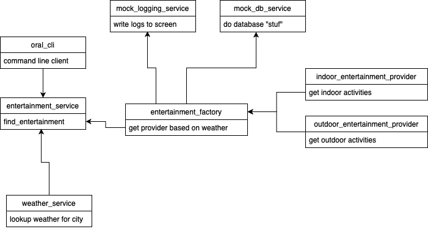

# ORNL Demo

## What the program does
This program will recommend an activity to keep you occupied based on the weather in the city you pass in.  It will lookup the weather from an external REST API.  If the weather is good, it will use an "outdoor provider" to find an activity to do outside.  If the weather is bad, it will use an "indoor provider".  The indoor provider reaches out to an external REST API to get indoor activities.

## Objectives
To write code that illustates how I think about software development principles.  Some of the important ones I tried to capture:

* Code readability
* Loose coupling:
    * Tiered architecture with more stable higher level layers
    * Easier and better testing
* Pluggable architecture and other approaches for extensibility
* Classes and abstract base classes: Clearly define the domain and state.  Also paints a clear picture of how a future engineer would add new components.
* Code documentation: I have generated HTML docs based on the code documentation.  That can be found [HERE](./docs/build/html/index.html)
* Explicit configuration: In one obvious place.  Not embedded deep in subsystems.


There are more principles that I find useful but I didn't have time to implement them.

## Installation
I chose conda since I already had it installed :) You are welcome to use any python environment manager.
```bash
git clone git@github.com:cvillej/ornl.git

cd ornl

conda create -n ornl python=3.6
conda activate ornl
conda install --file requirements.txt
```

## Running
You may need to set the PYTHONPATH enviornment variable.  Here is an example of how I set mine to run the application:
```bash
PYTHONPATH=/Users/jonathonfortney/dev/ornl
```

Run the program:
```bash
python ornl_cli.py
```


## Diagram
This is a crude diagram.  It is intended to give a general idea of the architecture and classes involved.  If I had more time these would be a little more formal and accurate.



## Obvious ommisions and immaturity
* Testing
* Error percolation, program flow based on errors and more formal error trapping and handling
* Better design docs


